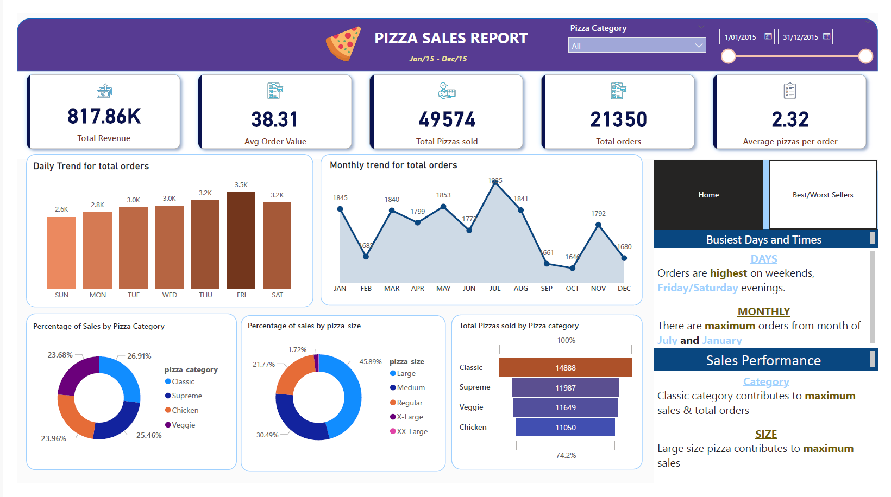
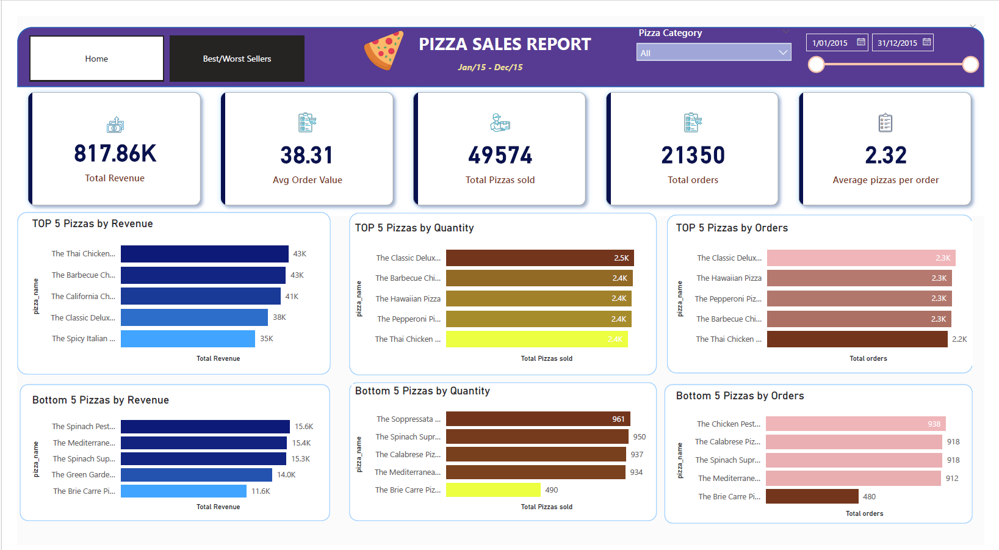

# 🍕 Pizza Sales Analysis | SQL + Power BI

## 📌 Overview
End-to-end data analytics project analyzing pizza sales data from 2015,
combining SQL Server for data extraction and Power BI for visualization.

## 📊 Dashboard Pages
- **Home Dashboard** – KPIs, daily/monthly trends, 
  sales by category and size
- **Best/Worst Sellers** – Top 5 & Bottom 5 pizzas 
  by Revenue, Quantity, and Total Orders

## 🛠️ Tools & Technologies
- MS SQL Server Management Studio (SSMS)
- Power BI Desktop
- Power Query (Data cleaning & transformation)
- Excel (Validation documentation)

## 🗄️ SQL Implementation
- Calculated KPIs: Total Revenue, Avg Order Value, 
  Total Orders using CAST and aggregate functions
- Trend Analysis using DATENAME function
- Percentage contribution using subqueries
- Best/Worst sellers using TOP 5 with ORDER BY 
  DESC/ASC

## 💡 Key Features
- Custom conditional columns for chronological 
  sorting of day/month charts
- Dynamic date sliders and category filters
- Page navigation buttons between Home and 
  Best/Worst Sellers pages
- SQL validation document to verify Power BI metrics

## 🖼️ Dashboard Preview

